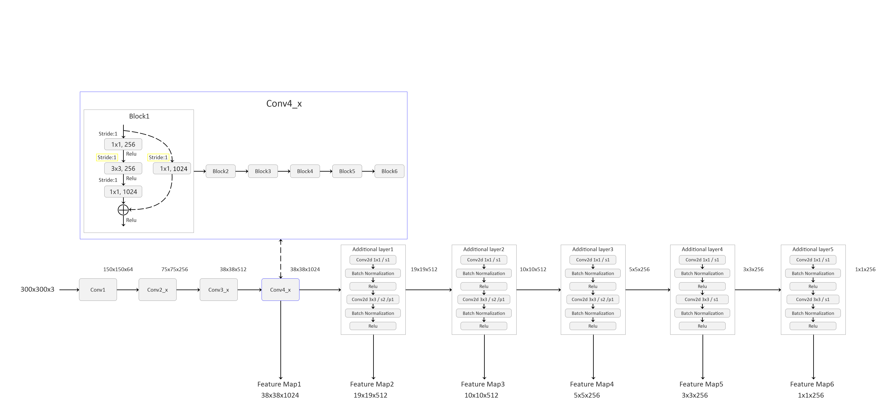

# SSD: Single Shot MultiBox Detector

## 文件结构：

```
├── src: 实现SSD模型的相关模块    
│     ├── resnet50_backbone.py   使用resnet50网络作为SSD的backbone  
│     ├── ssd_model.py           SSD网络结构文件 
│     └── utils.py               训练过程中使用到的一些功能实现
├── train_utils: 训练验证相关模块（包括cocotools）  
├── my_dataset.py: 自定义dataset用于读取VOC数据集    
├── train_ssd300.py: 以resnet50做为backbone的SSD网络进行训练    
├── train_multi_GPU.py: 针对使用多GPU的用户使用    
├── predict_test.py: 简易的预测脚本，使用训练好的权重进行预测测试    
├── pascal_voc_classes.json: pascal_voc标签文件    
├── plot_curve.py: 用于绘制训练过程的损失以及验证集的mAP
└── validation.py: 利用训练好的权重验证/测试数据的COCO指标，并生成record_mAP.txt文件
```

## 模型框架

